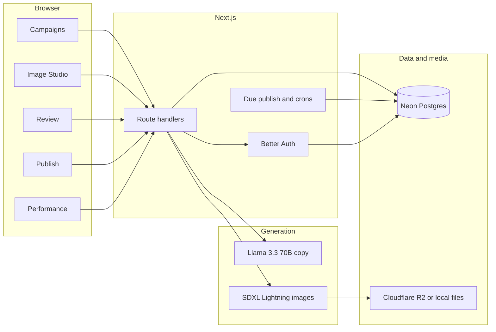
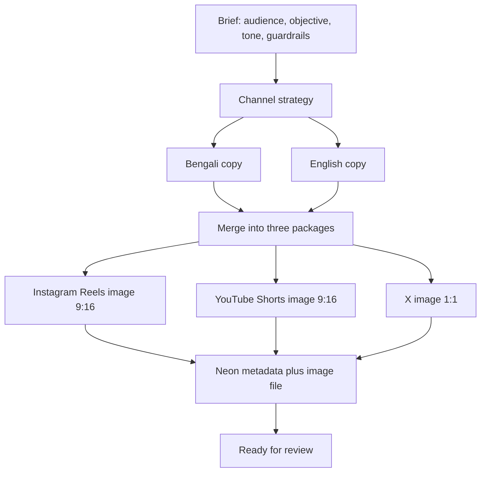
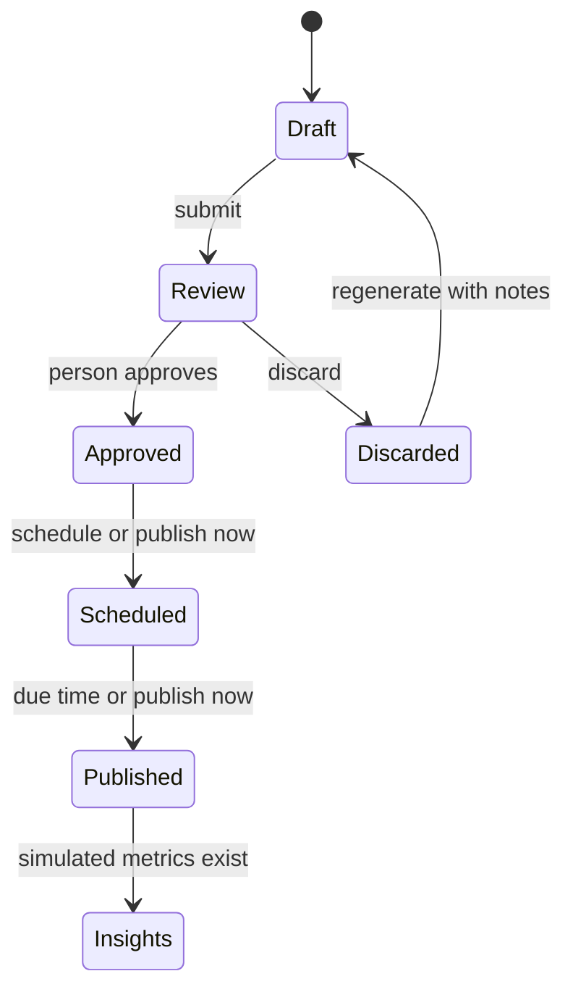
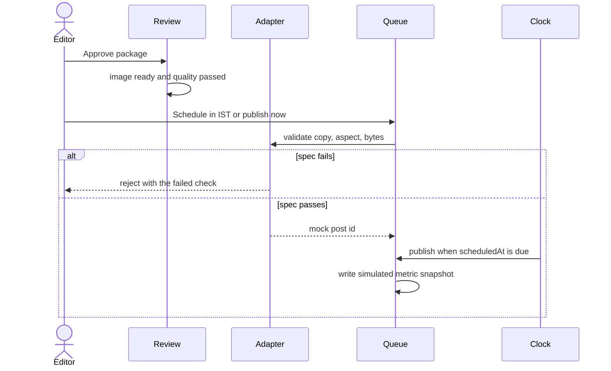
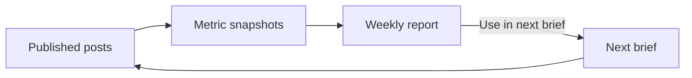
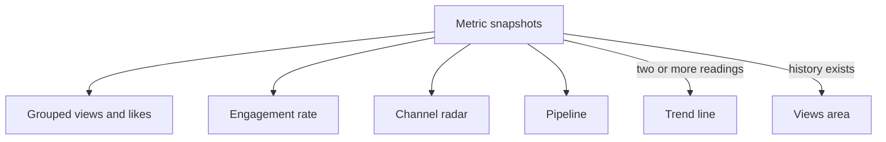
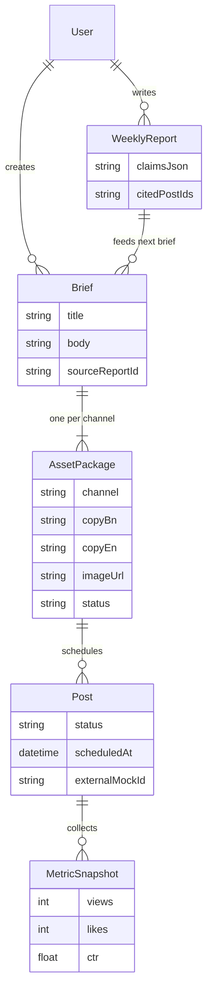

# Hoichoi Content Studio

AI content studio and multi platform command center for the hoichoi AI Builders Hackathon, Problem 3.

One Bengali brief becomes three channel packages. Bengali and English are written as separate originals. Instagram Reels, YouTube Shorts, and X each get their own image. A person approves the package before it can be scheduled. Publishing uses mock channel adapters. Metrics are simulated and labeled as simulated. Weekly insights cite the posts they came from and can open the next brief.

Video generation is designed and intentionally off in this release, so the image, review, publish, and insights loop stays reliable.

## Demo

```bash
npm install
npx prisma db push
npm run db:seed
npm run dev
```

Open http://localhost:3000/login

| | |
| --- | --- |
| Email | `editor@hoichoi.demo` |
| Password | `HoichoiDemo2026!` |

Google sign in works when `GOOGLE_CLIENT_ID` and `GOOGLE_CLIENT_SECRET` are set. The redirect URI is `{BETTER_AUTH_URL}/api/auth/callback/google`.

## What a judge should see

1. Sign in and open a Bengali brief, or create one.
2. Generate. Show Bengali and English that were not translated from each other, and three images that are not one crop.
3. Review. Edit, or discard and regenerate with notes. Approve only when the image is ready.
4. Publish. Pick a time or publish now. The adapter rejects copy or images that break the channel spec.
5. Performance. Compare channels, read one weekly insight, and send it into the next brief.

## Architecture



| Layer | Choice |
| --- | --- |
| App | Next.js 15 App Router, TypeScript, Tailwind 4 |
| Auth | Better Auth, email and password, optional Google, editor role on writes |
| Data | Prisma 5 and Neon Postgres |
| Copy | Cloudflare Workers AI, Llama 3.3 70B, structured JSON |
| Images | Workers AI SDXL Lightning, one prompt per channel |
| Media | Cloudflare R2 in production, `public/generated/` locally |
| Charts | Apache ECharts |
| Publish | Mock adapters with real spec checks |
| Metrics | Deterministic simulated snapshots, labeled simulated |

## Generation pipeline

Strategy is planned once. Bengali and English are then written in parallel from the brief, not from each other. Each channel image is generated from that channel's composition.



Quality checks require a ready image, a real provider (not the SVG fallback), three different image prompts, and copy that fits the channel. Approve and submit both refuse a package that fails those checks.

## Approval and publish pipeline

Approval does not publish. It only allows a later schedule. Schedule and publish now both refuse a package that is not approved.





Locally, due posts flush when Publish loads, on a 20 second timer in the app shell, and when a schedule is already due. On Vercel, `/api/cron/publish-due` runs every minute and requires `Authorization: Bearer $CRON_SECRET`.

| Channel | Frame | Copy limit | Hashtags |
| --- | --- | --- | --- |
| Instagram Reels | 9:16, 1080×1920 | caption 2200 | 30 |
| YouTube Shorts | 9:16, 1080×1920 | title 100, description 5000 | 15 |
| X | 1:1, 1080×1080 | 280 characters | 5 |

## Insights loop

Published posts get a simulated snapshot: views, likes, comments, shares, saves, and click through rate. The weekly report may only cite post ids that exist. **Use in next brief** creates a brief with `sourceReportId` and carries the channel tactics forward.



## Performance charts

All charts read this product's channels: Instagram Reels, YouTube Shorts, and X. Counts stay in real units. Engagement rate is never drawn on the same axis as views.

| Chart | Question it answers | Data |
| --- | --- | --- |
| Grouped columns | How do views and likes compare by channel? | Latest snapshot, raw counts |
| Engagement bars | Which channel earns a higher rate? | Likes, comments, shares, and saves over views |
| Radar | How does each channel's profile differ? | Rates on a 0 to 100 scale, real percents in the tooltip |
| Pipeline | Where does this campaign sit? | Brief through Insights, plus discarded when that happened |
| Trend line | Are later readings moving? | Shown after two or more snapshots |
| Views area | How did views accumulate? | Shown only when history exists |

One publish creates one snapshot. The trend and area charts stay empty until a metrics refresh writes a second reading. That is intentional.



## Data model



Package status is `draft`, `pending_approval`, `approved`, or `discarded`. Post status is `scheduled`, `publishing`, `published`, or `rejected`.

## Routes

| Surface | Path |
| --- | --- |
| Campaigns | `/` |
| Image Studio | `/studio` |
| Video Studio | `/studio/videos` |
| Review | `/approvals` |
| Publish | `/publisher` |
| Performance | `/insights` |
| Integrations | `/integrations` |
| Sign in | `/login` |
| Sign up | `/signup` |

Video Studio is a locked next release page. Generate is disabled.

## Project layout

```text
src/app/(app)          campaigns, studio, review, publish, insights
src/app/(auth)         sign in and sign up
src/app/api            briefs, packages, publisher, insights, cron, auth
src/lib/ai             strategy, native copy, image generation
src/lib/studio         brief generation and regenerate
src/lib/platforms      channel specs and mock adapters
src/lib/insights       simulated metrics and weekly reports
src/lib/jobs           publish due posts
src/components/analytics   ECharts
prisma/schema.prisma   Neon models
```

## Setup

Copy `.env.example` to `.env`.

Required:

- `DATABASE_URL` from Neon, pooled, SSL on
- `BETTER_AUTH_URL` and `BETTER_AUTH_SECRET` (32 characters or more)

Generation:

- `CLOUDFLARE_ACCOUNT_ID` and `CLOUDFLARE_API_TOKEN` with AI Gateway Run and Workers AI Read
- `CLOUDFLARE_WORKERS_TEXT_MODEL=@cf/meta/llama-3.3-70b-instruct-fp8-fast`
- `CLOUDFLARE_IMAGE_MODEL=@cf/bytedance/stable-diffusion-xl-lightning`
- `CLOUDFLARE_UNIFIED_BILLING=false` when using Workers AI credits

Optional:

- `OPENROUTER_API_KEY` as a text fallback
- `POLLINATIONS_API_KEY` as an image fallback
- `GOOGLE_CLIENT_ID` and `GOOGLE_CLIENT_SECRET`
- `R2_ACCOUNT_ID`, `R2_ACCESS_KEY_ID`, `R2_SECRET_ACCESS_KEY`, `R2_BUCKET`, `R2_PUBLIC_URL`

Without R2, images are written under `public/generated/`. That folder is not durable on serverless. Set R2 before a Vercel deploy, then set the same env vars and `CRON_SECRET`.

```bash
npm run db:push
npm run db:seed
npm run dev          # local
npm run build && npm run start
npm test             # unit and integration
npm run test:e2e     # Playwright
```

## Security

- Mutating APIs require a session. Publishing and approval require the editor role.
- Cron routes require `CRON_SECRET`.
- Generation and publish are rate limited in Postgres.
- Provider calls, approvals, discards, and publishes are written to the audit log.
- API keys stay on the server.
- New accounts default to editor.

## Honest limits

- Channel accounts on Integrations are a connected accounts view. Posting does not call Instagram, YouTube, or X.
- Metrics are simulated from the post id. They are not platform analytics.
- Video prompts are stored. No clip is rendered in this release.
- Trend charts appear after a second metric snapshot, not from a single publish.
